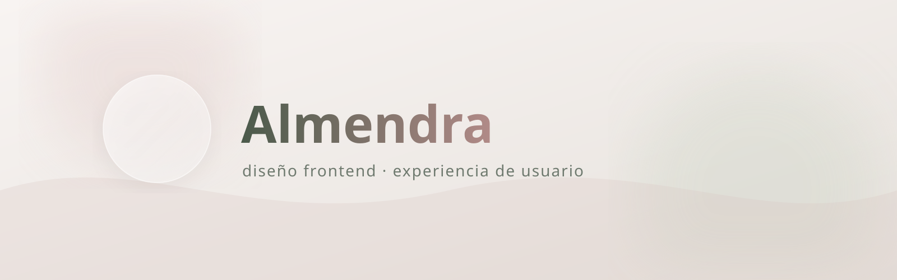
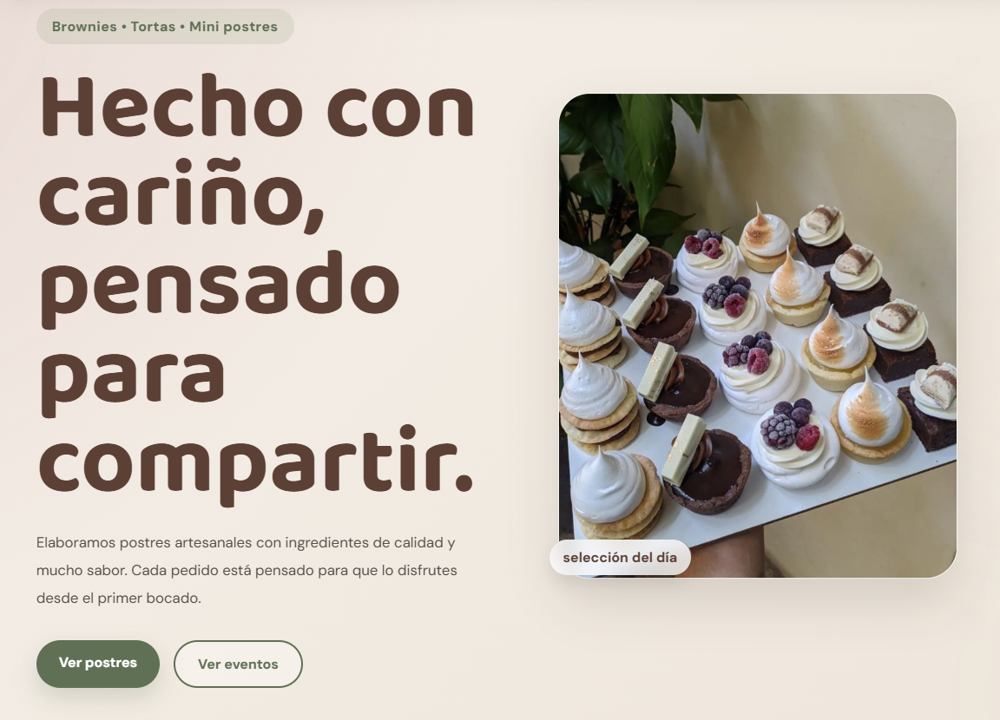
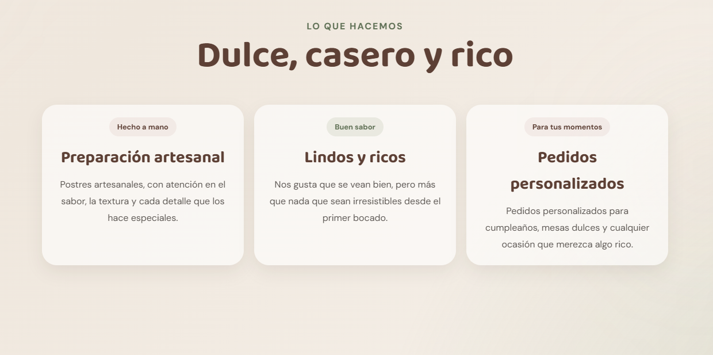
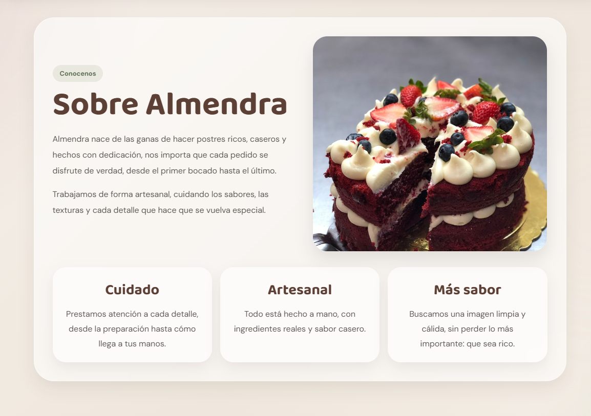

  

 

  Sitio web desarrollado para una pastelería artesanal ficticia

  

# Descripción

**Almendra** es un proyecto de diseño y desarrollo frontend inspirado en una identidad visual cálida, artesanal y moderna.

La idea principal fue crear una experiencia visual que transmitiera cercanía, estética y una navegación agradable, utilizando animaciones suaves y una composición mucho más dinámica que una página tradicional.

El proyecto fue desarrollado completamente con HTML y CSS, priorizando:

- Identidad visual
- Experiencia de usuario
- Composición moderna
- Animaciones sutiles

---

# ✦ Diseño y experiencia

El objetivo principal no era solamente "hacer una web funcional", sino construir una experiencia visual completa,   que busca transmitir:
- Calidez
- Cercanía
- Estética artesanal
- Suavidad visual

Por eso el proyecto incluye:

- micro animaciones
- efectos hover
- composición visual moderna
- jerarquía tipográfica
- ritmo visual entre secciones
- consistencia de identidad
- navegación clara
- estética inspirada en sitios reales de branding gastronómico

---

#  Tecnologías utilizadas

  

  HTML &nbsp;&nbsp;•&nbsp;&nbsp;
  CSS &nbsp;&nbsp;•&nbsp;&nbsp;
  VS Code &nbsp;&nbsp;•&nbsp;&nbsp;
  GitHub &nbsp;&nbsp;•&nbsp;&nbsp;
  Figma

---

# Vista del proyecto

  

  Página principal del sitio

 

  

  Sección de identidad

 

  

  Vista de nosotros

---

# Objetivos del proyecto

Este proyecto fue creado con el objetivo de practicar y mejorar habilidades relacionadas con:

- Diseño frontend
- Composición visual
- Branding digital
- Experiencia de usuario
- Responsive design
- Estructuras modernas en CSS
- Diseño inspirado en productos reales

---

## ✦  Ingresa! : [Almendra](https://renaaa189.github.io/Almendra/index.html)

  

